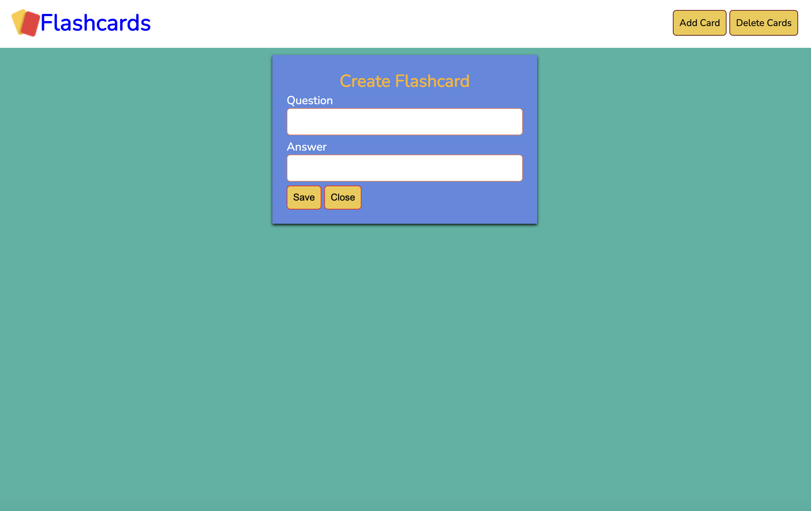
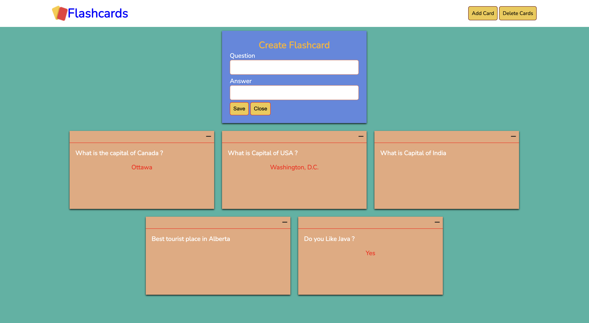

# Flashcards

Programming language:  HTML,  CSS,   Javascript 

Software used: 

Visual Studio Code

A responsive web page that lets the user creates flashcards for thier exams preparation or for some other use. It doesn't reset everytime user refresh page. 

Upon clicking add card, create flashcard box will appear where you can write your own questions and their answer and save it to create that flashcard. 

Clicking one time on question flashcard will reveal its answer. 

Clicking delete cards will delete all the cards.

 

